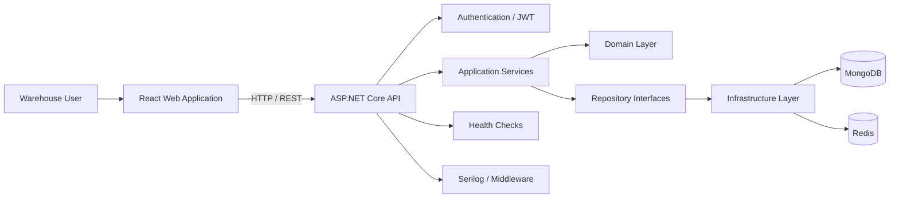

<div align="center">

# 📦 Warsehouse

### Warehouse Management System

**Inventory · Stock · Goods Movement · Reservations · Reporting · Warehouse Operations**

[](./api)
[](./web)
[](./web)
[](./web)
[](./api)
[](./api)
[](./api)

A full-stack Warehouse Management System (WMS) for managing products, warehouse stock, inventory operations, goods transactions, reservations, movements, costing, and operational reports from one application.

</div>

---

## Table of Contents

- [Overview](#overview)
- [System Capabilities](#system-capabilities)
- [Architecture](#architecture)
- [Application Modules](#application-modules)
- [Technology Stack](#technology-stack)
- [Repository Structure](#repository-structure)
- [Backend](#backend)
- [Frontend](#frontend)
- [Getting Started](#getting-started)
- [Development Commands](#development-commands)
- [Testing](#testing)
- [Security and Reliability](#security-and-reliability)
- [Repository History](#repository-history)

---

## Overview

**Warsehouse** is a warehouse operations platform that combines the original warehouse API and warehouse web application into a single monorepo.

The system is designed around common Warehouse Management System workflows:

- maintaining warehouse and product master data;
- viewing available stock and inventory information;
- recording physical inventory;
- handling goods transactions and warehouse movements;
- reserving stock;
- generating average costs;
- tracking material and product movements;
- analyzing stock value and Pareto data;
- authenticating users and protecting application routes;
- exposing operational health and API infrastructure for deployment.

The repository contains two applications:

| Application | Purpose | Location |
| --- | --- | --- |
| **Warehouse API** | Business logic, authentication, persistence, reporting APIs and warehouse domain services | [`api/`](./api) |
| **Warsehouse Web** | Browser-based WMS interface for warehouse operations and reports | [`web/`](./web) |

---

## System Capabilities

### 🔐 Authentication & Session Access

The backend exposes authentication services and JWT-based authentication, while the frontend separates public and private application routes.

Core capabilities include:

- user login;
- authenticated/private WMS routes;
- JWT bearer authentication;
- refresh-token domain support;
- login request validation;
- protected application screens;
- centralized API authentication handling.

### 🏭 Warehouse Setup

Warehouse configuration is exposed through the WMS setup area and warehouse APIs.

The system supports domain models and services for:

- warehouses;
- bins/storage locations;
- warehouse setup data;
- categories;
- business partners;
- warehouse-related reference data.

Frontend route:

```text
/wms/setup/warehouses
```

### 📦 Product Management

Product management provides the product-oriented master-data layer used by inventory and warehouse transactions.

Capabilities represented in the codebase include:

- product data retrieval and management;
- product categories;
- product details;
- product-related warehouse information;
- integration with inventory, movement, reservation and reporting services.

Frontend route:

```text
/wms/management/product-management
```

### 📊 Stock Management & Stock Reporting

The system contains dedicated stock domain models, repositories, services, DTOs and UI reporting pages.

Supported areas include:

- warehouse stock lookup;
- stock details;
- stock reporting;
- stock valuation reporting;
- stock data used by reservation and movement workflows.

Frontend routes:

```text
/wms/analysis/stock-report
/wms/analysis/valued-stock-report
```

### 🧮 Physical Inventory

Physical inventory functionality is available as a transaction workflow. The backend contains inventory entities, DTOs, repository and application services, including inventory types and inventory details.

Frontend route:

```text
/wms/transactions/physical-inventory
```

### 🚚 Goods Movement

Goods movement functionality tracks movement of stock within warehouse operations, including movement records, details, summaries, reports, period-based summary support and dedicated APIs/services.

Frontend route:

```text
/wms/transactions/goods-movement
```

### 🔄 Goods Transactions

The application contains query and command-oriented goods transaction functionality, covering transaction records, detailed data, APIs, application services, repository persistence and a frontend workflow.

Frontend route:

```text
/wms/transactions/goods-transaction
```

### 🔒 Stock Reservation

Stock reservation provides reservation entities, reservation details, DTOs, repository access, application services and a dedicated UI.

Frontend route:

```text
/wms/transactions/stock-reservation
```

### 💰 Average Cost Generation

The WMS includes a dedicated transaction screen for generating average costs.

```text
/wms/transactions/generate-average-costs
```

### 📈 Reporting & Analytics

The web application includes dedicated reporting areas for:

- material transaction reports;
- product movement reports;
- valued stock reports;
- Pareto product reports;
- stock reports.

Routes:

```text
/wms/analysis/material-transaction-report
/wms/analysis/product-movements-report
/wms/analysis/valued-stock-report
/wms/analysis/pareto-product-report
/wms/analysis/stock-report
```

### ❤️ Health & Operational Infrastructure

The API includes operational support for production environments:

- health-check endpoints;
- MongoDB health checks;
- centralized exception middleware;
- request correlation middleware;
- rate limiting;
- structured logging with Serilog;
- OpenAPI / Swagger support;
- Docker deployment support.

---

## Architecture



### Backend Layering

```text
API
 │
 ▼
Application
 │
 ▼
Domain
 │
 ▼
Infrastructure
 │
 ├── MongoDB
 └── Redis
```

| Layer | Responsibility |
| --- | --- |
| **API** | Controllers, middleware, authentication, dependency injection, health checks and HTTP infrastructure |
| **Application** | Use-case services, DTOs, validation and application-level business operations |
| **Contract** | Shared API contracts and response structures |
| **Domain** | Warehouse entities, enums and repository abstractions |
| **Infrastructure** | MongoDB/Redis configuration and concrete repository implementations |

---

## Application Modules

| Area | Backend | Web UI |
| --- | :---: | :---: |
| Authentication | ✅ | ✅ |
| Warehouse setup | ✅ | ✅ |
| Bin management/domain | ✅ | Used by warehouse operations |
| Business partners | ✅ | Used by warehouse operations |
| Categories | ✅ | Used by product/domain flows |
| Product management | ✅ | ✅ |
| Stock | ✅ | ✅ |
| Physical inventory | ✅ | ✅ |
| Goods movement | ✅ | ✅ |
| Goods transaction | ✅ | ✅ |
| Stock reservation | ✅ | ✅ |
| Average cost workflow | Supporting services/domain | ✅ |
| Material transaction report | ✅ | ✅ |
| Product movement report | ✅ | ✅ |
| Valued stock report | ✅ | ✅ |
| Pareto report | ✅ | ✅ |
| Health check | ✅ | — |
| Rate limiting | ✅ | — |
| API error handling | ✅ | Integrated through API client |

---

## Technology Stack

### Backend

| Technology | Usage |
| --- | --- |
| **.NET 9 / ASP.NET Core** | REST API runtime |
| **MongoDB** | Warehouse data persistence |
| **Redis / StackExchange.Redis** | Redis integration and ASP.NET data protection |
| **JWT Bearer** | API authentication |
| **FluentValidation** | Request validation |
| **Serilog** | Structured logging |
| **AspNetCoreRateLimit / System.Threading.RateLimiting** | API rate limiting |
| **Swagger / OpenAPI** | API discovery/documentation |
| **ASP.NET Health Checks** | Service and MongoDB health monitoring |
| **Docker** | Containerized backend deployment |

### Frontend

| Technology | Usage |
| --- | --- |
| **React 19** | UI framework |
| **TypeScript 5.9** | Type-safe frontend development |
| **Vite 7** | Development and production build tooling |
| **React Router 7** | Application routing |
| **Redux Toolkit** | Application state management |
| **Redux Saga** | Side effects and async workflows |
| **Redux Persist** | Client-state persistence |
| **Axios** | HTTP API communication |
| **TanStack Table** | Data-table experiences |
| **React Hook Form** | Form handling |
| **Tailwind CSS 4** | Styling |
| **Radix UI** | Accessible UI primitives |
| **Lucide React** | Icons |
| **React Toastify** | User notifications |
| **ESLint + Prettier** | Code quality and formatting |

---

## Repository Structure

```text
warsehouse/
│
├── api/                              # ASP.NET Core backend
│   ├── Dockerfile
│   ├── docker-compose.yml
│   ├── warehouse-api-dotnet.sln
│   ├── src/
│   │   └── WarehouseBusiness/
│   │       ├── API/
│   │       ├── Application/
│   │       ├── Contract/
│   │       ├── Domain/
│   │       └── Infrastructure/
│   └── tests/
│       └── WarehouseBusiness.UnitTests/
│
├── web/                              # React + TypeScript frontend
│   ├── package.json
│   ├── vite.config.ts
│   ├── public/
│   └── src/
│       ├── apis/
│       ├── components/
│       ├── context/
│       ├── hocs/
│       ├── hooks/
│       ├── routers/
│       ├── state/
│       └── utils/
│
└── README.md
```

> Folder names are intentionally short at the monorepo level. Internal project names such as `warehouse-api-dotnet.sln` and the frontend package name remain unchanged to avoid unnecessary build/configuration changes.

---

## Backend

### Main API Areas

```text
Auth
Bin
Business Partner
Category
Health Check
Goods Transaction
Inventory
Movement
Pareto
Product
Reservation
Setups
Stock
Warehouse
```

### Domain Model

```text
Warehouse
Bin
Product
Category
BusinessPartner
Inventory
Stock
Movement
GoodTransaction
Reservation
Pareto
User
RefreshToken
Address
Contact
```

### Run Backend Locally

```bash
cd api

dotnet restore
dotnet build warehouse-api-dotnet.sln
dotnet run --project src/WarehouseBusiness/API/API.csproj
```

> The API expects its MongoDB/Redis and application configuration to be available through backend configuration files/environment variables for the target environment.

### Run Backend with Docker

```bash
cd api
docker compose up --build
```

The included compose configuration exposes the API on:

```text
http://localhost:8081
```

---

## Frontend

### Main Web Areas

```text
Product Management
Stock Report
Material Transaction Report
Product Movements Report
Valued Stock Report
Pareto Product Report
Warehouse Setup
Physical Inventory
Goods Movement
Goods Transaction
Stock Reservation
Generate Average Costs
```

### Routes

| Module | Route |
| --- | --- |
| Login | `/wms/auth/login` |
| Product Management | `/wms/management/product-management` |
| Warehouse Setup | `/wms/setup/warehouses` |
| Physical Inventory | `/wms/transactions/physical-inventory` |
| Goods Movement | `/wms/transactions/goods-movement` |
| Goods Transaction | `/wms/transactions/goods-transaction` |
| Stock Reservation | `/wms/transactions/stock-reservation` |
| Generate Average Costs | `/wms/transactions/generate-average-costs` |
| Stock Report | `/wms/analysis/stock-report` |
| Material Transaction Report | `/wms/analysis/material-transaction-report` |
| Product Movements Report | `/wms/analysis/product-movements-report` |
| Valued Stock Report | `/wms/analysis/valued-stock-report` |
| Pareto Product Report | `/wms/analysis/pareto-product-report` |

### Run Frontend Locally

```bash
cd web
npm ci
npm run dev
```

Production build:

```bash
npm run build
```

Preview:

```bash
npm run preview
```

---

## Getting Started

### Prerequisites

For local full-stack development, install:

- Git;
- .NET 9 SDK;
- Node.js/npm compatible with the frontend toolchain;
- MongoDB reachable by the backend;
- Redis reachable by the backend;
- Docker / Docker Compose if using the containerized backend workflow.

### Clone

```bash
git clone https://github.com/khovan123/warsehouse.git
cd warsehouse
```

### Start the API

```bash
cd api
dotnet restore
dotnet run --project src/WarehouseBusiness/API/API.csproj
```

Or:

```bash
cd api
docker compose up --build
```

### Start the Web Application

In another terminal:

```bash
cd web
npm ci
npm run dev
```

---

## Development Commands

### Backend

```bash
# Restore dependencies
dotnet restore api/warehouse-api-dotnet.sln

# Build
dotnet build api/warehouse-api-dotnet.sln

# Test
dotnet test api/warehouse-api-dotnet.sln
```

### Frontend

```bash
cd web

npm run dev
npm run build
npm run lint
npm run lint:format
npm run format
npm run preview
```

---

## Testing

Backend tests are located under:

```text
api/tests/WarehouseBusiness.UnitTests/
```

Run all .NET tests with:

```bash
dotnet test api/warehouse-api-dotnet.sln
```

Frontend quality checks:

```bash
cd web
npm run lint
npm run lint:format
npm run build
```

---

## Security and Reliability

The backend includes:

- **JWT authentication** for protected API access;
- **refresh-token domain support**;
- **FluentValidation** for request validation;
- **centralized exception middleware**;
- **correlation middleware** for request tracing;
- **API rate limiting**;
- **Serilog structured logging**;
- **health checks**, including MongoDB health integration;
- **Redis-backed ASP.NET data-protection integration**;
- **Dockerized deployment support**.

---

## Repository History

This monorepo was consolidated from two GitLab projects:

```text
openbravo2/warsehouse/warehouse-api-dotnet
openbravo2/warsehouse/warsehouse-web
```

Their application contents now live at:

```text
api/
web/
```

The original Git histories were imported without rewriting their original commit objects. Historical source branches are preserved in GitHub using namespaces such as:

```text
api/*
web/*
```

The monorepo default branch is `main`.

---

<div align="center">

### Warsehouse WMS

**One repository for warehouse operations, inventory, transactions and analytics.**

</div>
